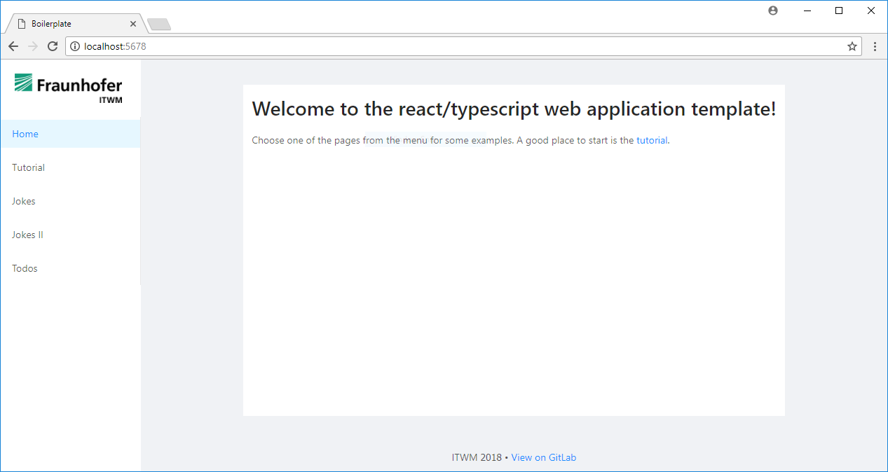

# A Template for Web-App Development with React and Typescript

This is a template (“boilerplate”) for creating a web application frontend (that is, an application that runs in a web browser). It uses 
- the [React](https://reactjs.org/) UI framework
- the [Typescript](http://www.typescriptlang.org/) programming language
- the [webpack](https://webpack.js.org/) build tool
- the [Yarn](https://yarnpkg.com) package manager

Core features:
- [Typescript](http://www.typescriptlang.org/)
- [React](https://reactjs.org/) with hot reloading and [router](https://github.com/ReactTraining/react-router)
- [Sass (scss)](http://sass-lang.com/) support

Optional:
- [ant design](http://ant.design) UI library
- [Redux](https://redux.js.org/) with [typescript-fsa](https://github.com/aikoven/typescript-fsa)

## Authors
- Original boilerplate: [Tobias Zimmermann](@zimmermann)
- Adaption and extension: [Michael Helmling](@helmling) and [Phil Süss](@suess)

# Getting Started

## Install the Requirements
1. [Visual Studio Code](https://code.visualstudio.com/) with the following extensions:
    - Debugger for Chrome
    - EditorConfig for VS Code
    - TSLint
    - Sass
2. [Node.js](https://nodejs.org/en/)
3. [Yarn](https://yarnpkg.com/)
4. [Google Chrome](https://www.google.com/chrome/) with the following extensions (optional):
    - React Developer Tools
    - Redux DevTools
5. *Checkout this git repository*

## Start the Development Server
Open the checked-out repository in VS code. Then, in the VS Code console:
- Install 3rd-party packages: `yarn install` *(a restart of VS Code may be necessary)*
- Start dev server: `yarn start` (or in VS code `Tasks → Run Task … → dev-server`)

Then start the browser: `F5`. You should see a screen similar to the following:

The visual studio code configuration is located in the [`.vscode`](.vscode) subdirectory.

# Description of the Boilerplate

## npm and yarn: package management
The [`package.json`](package.json) file centrally defines your project (comparable to a `csproj` or `sln` file in C#).

This file defines
- your project's name, version etc.,
- other 3rd-party packages your project depends on,
- a set of *scripts* that can be run in your project (e.g. “build”, “run dev-server”, …)

Third-party packages are installed into the [`node_modules`](node_modules) subdirectory.

While originally defined by npm, the yarn package manager operates on the same `package.json` file format and has some advantages. Yarn also owns [`yarn.lock`](yarn.lock) file.

## Webpack: the build tool
Webpack is a *bundler* for javascript—think of a compiler. It bundles (compiles) all your source files into *one* single javascript file called *bundle.js*. Via plugins, webpack accomplishes additional tasks:
- bundle resources (like images)
- bundle CSS stylesheets, compile SCSS or less into css
- compile typescript into plain javascript
- transpile javascript to support older browsers. This uses a tool named *babel*, configured in [`.babelrc`](.babelrc)
- provide a *development webserver* that delivers your app to a browser, supporting e.g. automatic reloading of the page whenever the source code changes

Webpack is configured in the [`webpack.config.js`](webpack.config.js) file. The plugins are usually named `<xxx>-loader` (webpack plugin supporting a special type of input) or `<xxx>-webpack-plugin` (other purpose plugin). A lot of the dependencies in [`package.json`](package.json) are webpack plugins!

## Typescript: the language
Typescript is configured in the [`tsconfig.json`](tsconfig.json) file. The [`typings`](typings) directory contains auxiliary type definitions.

The boilerplate also configures a *Linter* for typescript, that is, a tool that checks the code style according to defined rules (e.g. brace style). It is called *tslint* and configured in [`tslint.json`](tslint.json).

Another file somewhat related to linting is [`.editorconfig`](.editorconfig). [EditorConfig](http://editorconfig.org/) is an editor- and language-independent approach for defining certain file properties such as indentation, line endings and encoding.

# List of Top-Level Files / Directories
- [`.vscode`](.vscode): VS code configuration files
- `dist`: build output directory (created on e.g. `yarn run build:prod`)
- `node_modules`: downloaded 3rd-party packages
- [`src`](src): source code. **You will work here most of the time!**
- [`typings`](typings): auxiliary typescript type definitions
- [`.babelrc`](.babelrc): configuration file for [Babel](https://babeljs.io/)
- [`.editorconfig`](.editorconfig): configuration of line endings, indent etc.
- [`package.json`](package.json): main package definition, including 3rd-party dependencies
- [`tsconfig.json`](tsconfig.json): typescript configuration
- [`tslint.json`](tslint.json): configuration of [TSLint](https://palantir.github.io/tslint/), the linter for typescript
- [`webpack.config.js`]: Webpack (javascript bundler) configuration
- [`yarn.lock`]: Auxiliary file for yarn (tracks exact package versions)
